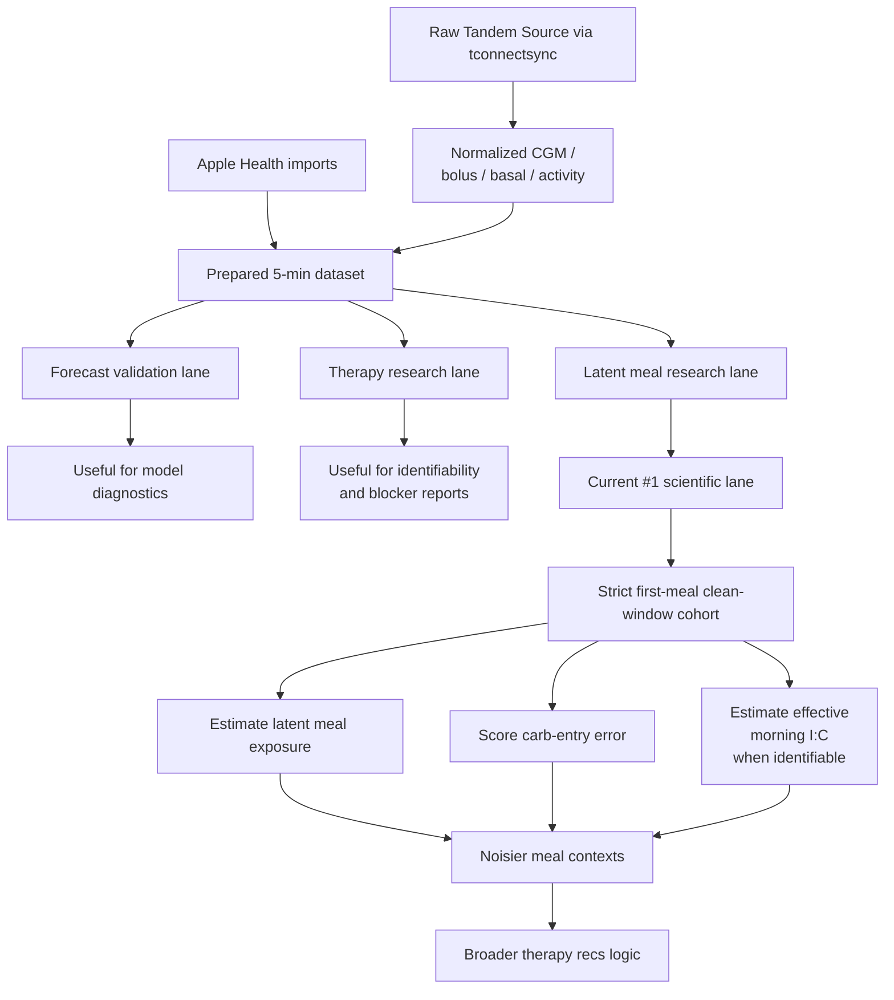

# Technical Lab Notebook: Bayesian T1DM

**Updated**: April 3, 2026  
**Branch**: `main`  
**Project**: Bayesian T1DM (`bayesian-t1dm`)  
**Purpose**: Technical status notebook for the checked-in `main` branch

## Scope Note

This notebook describes what the repository is actually trying to do right now and what the current branch really implements.

It is not a product roadmap, and it is not a promise that every checked-in workflow is equally important.

The point of this file is to reduce scatter by separating:

- active scientific priorities
- useful but secondary infrastructure
- experimental side tracks
- deferred ideas that should not drive day-to-day work yet

## Executive Summary

The repository is best understood as a **personal diabetes research workbench**, not a finished therapy-recommendation product.

The strongest current conclusion is not a therapy setting recommendation. It is a data-truth conclusion:

- the current `tconnectsync` Tandem raw archive does **not** appear to contain explicit carbohydrate records
- the canonical Tandem feature table therefore has `carb_grams == 0` and `meal_event == 0` everywhere unless meal information is supplied from some other source
- this makes direct recovery of basal, I/C, and sensitivity from observed glucose much harder than the repo originally hoped

That does **not** mean the project is blocked completely.

The current best scientific path is:

1. stop pretending meal truth is directly observed
2. treat meal response as a partially observed latent-signal problem
3. start with **strict, low-confounding first-meal windows**
4. estimate **latent meal exposure** and **carb-entry error** before trying to make broad therapy claims

## Current North Star

The near-term scientific question is:

**Can we identify useful meal-response information from the data we actually have, even when explicit carb truth is absent?**

More concretely:

- can we identify a subset of meals where latent carb exposure is estimable with useful uncertainty bounds?
- can we score whether an entered or implied carb amount was probably undercalled, overcalled, or roughly consistent with the observed response?
- can we learn a context-specific effective I/C signal for those high-quality windows only?

This is a better near-term target than trying to infer all therapy settings globally from all rows.

## Current Branch Reality

The checked-in branch has several real subsystems:

1. **Acquisition and normalization**
   - `tconnectsync` Tandem Source pulls
   - raw payload archival
   - normalized CGM / bolus / basal / activity tables
   - Apple Health import and overlap-aware dedupe

2. **Prepared analysis dataset**
   - Tandem-aligned 5-minute grid
   - insulin action and IOB expansion
   - Apple Health context alignment
   - rolling, lagged, and calendar features

3. **Forecast validation lane**
   - walk-forward glucose forecasting
   - baseline comparison
   - run summary and review artifacts

4. **Therapy research lane**
   - segment-level basal / I:C identifiability review
   - source report cards
   - model comparison and recommendation suppression

5. **Latent meal research lane**
   - meal event registry
   - meal-window extraction
   - latent carb / effective I:C approximation
   - confidence and identifiability reporting

These are all real code paths, but they should not all be treated as equal strategic priorities.

## What We Know Right Now

### 1. The Tandem raw archive is not giving us explicit carb truth

Current archived `tconnectsync` raw payload families are:

- `activity`
- `basal`
- `bolus`
- `cgm`
- `pump_event_metadata`

The sampled `bolus.json` records currently expose only insulin amount, timestamp, and source-event metadata, not explicit carbohydrate values.

Operational implication:

- explicit Tandem carb truth is currently unavailable in the canonical raw source

### 2. The prepared Tandem feature table reflects that absence

In the current runtime outputs, the Tandem source report card shows:

- `carb_grams` all zero
- `meal_event` all zero
- `minutes_since_last_meal` all zero

Operational implication:

- the base feature frame should not be interpreted as containing observed meal truth

### 3. Some Health-derived context features were malformed and needed repair

Known fixes already landed:

- workout recency/count windows were repaired
- plausibility guards were added for workout summaries
- sparse physiology such as HRV and resting heart rate now carries freshness metadata instead of only silent zero-fill semantics

Operational implication:

- Apple context is still useful, but it must be handled as partially missing and quality-gated

### 4. The repo has been mixing several goals at once

The codebase currently mixes:

- forecasting
- therapy recommendation support
- feature engineering diagnostics
- source auditing
- latent meal inference

Operational implication:

- without a lab-notebook-style priority structure, the project feels more advanced than it actually is

## Working Scientific Frame

The most useful framing right now is:

**Observed glucose is a mixed response signal generated by latent meal exposure, insulin delivery, basal state, closed-loop behavior, exercise/recovery, sleep, stress, and measurement gaps.**

This means:

- we should stop thinking in terms of “recover the true carbs directly from the table”
- we should instead think in terms of **latent meal-response deconvolution under uncertainty**

The ABSOLUTE analogy is still helpful at the level of mindset:

- infer hidden contributors from indirect noisy observations
- quantify uncertainty
- separate what is observed from what is inferred

The analogy breaks if we pretend glucose is a static mixture problem. It is a dynamic feedback-controlled system.

So the active model worldview should be:

- **hierarchical meal-response estimation**
- **strict identifiability gating**
- **honest suppression when the window is too confounded**

## Active Research Priority

The repo should focus on one primary research lane for now:

### Priority 1: Clean First-Meal Meal-Response Windows

Initial target cohort:

- first meal or first meal-like bolus of the day
- long fasting interval beforehand
- premeal BG in or near target
- low premeal IOB
- little evidence of recent correction activity
- little evidence of recent workout carryover
- high enough CGM coverage through the post-meal horizon

Primary estimands for this phase:

- latent meal exposure
- carb-entry consistency or error score
- morning first-meal effective I/C, only when identifiable

Why this comes first:

- it is the least confounded setting available in the current data
- it gives the best chance of learning whether the latent-meal program is scientifically useful
- it can later serve as training or calibration data for messier meal windows

## Explicitly Deferred For Now

These are not abandoned forever, but they should not be allowed to drive the repo in the next phase:

- global basal optimization as the main headline
- sensitivity-factor inference as a primary target
- generalized therapy recommendations across all meal contexts
- claiming exact meal carb truth for every bolus
- broad productization of the dashboards as if they are already decision-ready

## How The Pieces Fit Together

## Directional Map

The practical interpretation of the diagram is:

- the forecasting lane stays alive because it catches model-quality failures
- the therapy research lane stays alive because it reports blockers honestly
- the latent meal lane becomes the main scientific workstream
- all broader recommendation logic is downstream of whether the clean-window latent meal program succeeds

## Immediate Work Program

### Phase A: Truthful data semantics

Goals:

- stop letting missing meal truth masquerade as observed zeros
- mark explicit carb truth as missing or unavailable where appropriate
- keep source-quality metadata visible in reports

Definition of done:

- the base dataset no longer suggests that all-zero meal features are trustworthy meal observations

### Phase B: Strict first-meal cohort builder

Goals:

- define and materialize a very conservative morning clean-window cohort
- record inclusion and exclusion reasons
- quantify how many usable windows actually exist

Definition of done:

- one artifact that tells us exactly how many high-quality first-meal windows are available and why others were rejected

### Phase C: Latent meal exposure model for clean windows

Goals:

- estimate latent meal exposure from bolus plus glucose response
- use programmed I/C as a prior, not truth
- output uncertainty and identifiability status

Definition of done:

- meal-level outputs are interpretable as research estimates rather than ad hoc heuristics

### Phase D: Carb-entry error scoring

Goals:

- classify likely undercount / overcount / roughly consistent meal entries when any meal entries exist
- produce a score that remains useful even when exact truth is unknowable

Definition of done:

- the repo can say something more useful than “carbs are missing” for at least a subset of meal windows

### Phase E: Expansion to less clean windows

Goals:

- test whether a clean-window-trained or clean-window-calibrated model transfers to less ideal meals
- preserve more aggressive uncertainty and suppression in these noisier settings

Definition of done:

- evidence that the clean-window program generalizes at least somewhat without pretending the noisy meals are equally identifiable

## Decision Rules For New Work

When adding or changing anything in this repo, the first question should be:

**Does this help the clean-window latent meal program, or is it a side quest?**

If it is a side quest, it should usually wait.

Concrete triage rules:

- work that improves source truth, missingness semantics, or meal-window quality is high priority
- work that improves latent meal identifiability is high priority
- work that only makes dashboards prettier is low priority
- work that assumes recommendations are already trustworthy is premature
- work that broadens scope without improving identifiability should usually be deferred

## Repo Orientation

Use the repo like this:

- `README.md` for onboarding and command entrypoints
- `docs/technical.md` for lower-level implementation and data-flow notes
- `docs/TECHNICAL_LAB_NOTEBOOK.md` for scientific direction, branch truth, and active priorities

This notebook should be updated whenever one of these changes:

- the active scientific question
- the highest-confidence data-truth conclusion
- the primary research lane
- the set of explicitly deferred goals

## Current One-Sentence Summary

This repo is currently a **research-first meal-response inference workbench** whose next serious job is to learn what can be identified from strict, low-confounding first-meal windows when explicit Tandem carb truth is absent.
